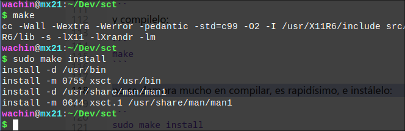

# xsct_gui
Una GUI (Interfaz Gráfica de Usuario) para xsct (para establecer la temperatura del color de la pantalla).

**xsct** es un pequeño programa en C para cambiar la temperatura de color de la pantalla. Se puede utilizar para reducir o aumentar la cantidad de luz azul que produce la pantalla.

La herramienta xsct establece la temperatura de color de la pantalla a través de xrandr como redshift. A diferencia de redshift, solo tiene 80 líneas de C y no cambiará la temperatura de la pantalla automáticamente.

# Tutorial de uso: xsct GUI

Este tutorial te guiará a través del uso de la interfaz gráfica para el programa xsct, que te permite ajustar la temperatura de color y el brillo de tu monitor en Linux Debian 12 o derivados de ellos como MX Linux 23 y puede que funcione en otras versiones u otros Linux.

## Requisitos previos

Antes de comenzar, asegúrate de tener instalado lo siguiente:

1. Python 3
2. Tkinter (paquete python3-tk)
3. python3-pil.imagetk (Biblioteca de imagenes)
4. El programa xsct
5. Papirus Icon Theme

Puedes instalar los paquetes necesarios con el siguiente comando:

```
sudo apt install python3 python3-tk xsct python3-pil.imagetk python3-cairosvg
```

**Nota**: En mi Sistema Linux Debian 12 tengo instalado además los siguientes paquetes: python3-all-dev tk-dev python3-full idle pero parece que no son necesarios.

# Explicación de los paquetes

**python3** el lenguaje interactivo de alto nivel y orientado a objetos, incluye una extensa biblioteca de clases con muchas funciones útiles para programación de redes, administración de sistemas, sonidos y gráficos. (Debe estar instalado por defecto)  
**python3-tk** Es un módulo para escribir aplicaciones GUI portátiles con Python 3.x utilizando Tk. También conocido como Tkinter.  
**python3-pil.imagetk** Biblioteca de imágenes de Python: módulo ImageTk "Python3". Con este paquete no necesitamos instalar: "pip install Pillow", es decir tenemos Pillow nativo. Pillow es un fork moderno de PIL (Python Imaging Library) que tiene funcionalidades como crear y mostrar imágenes simples. Cuando importamos "from PIL import Image", ImageTk en el script, está utilizando esta versión de Pillow, esto sirve para mostrar los colores degradados de las barras estáticas de gradientes de temperatura y de brillo.  
**python3-cairosvg** Este paquete es para que el programa pueda manejar iconos svg ya que Papirus los usa en este formato y sin este paquete no muestra ningún icono.  
**Papirus Icon Theme** Es necesario para el icono del programa, si usa MX Linux 21, 23 está presente en los repositorios. Si usas otro Linux basado en Debian una manera rapida de instalar papirus si no está disponible es instalando los repositorios de MX Linux:  

**Añadir el repositorio de MX Linux a Debian 12, 11, 10 y a S.O. Linux basados en el**  
https://facilitarelsoftwarelibre.blogspot.com/2023/11/como-anadir-el-repositorio-de-mx-linux-en-basados-en-debian.html  

También se puede instalar directamente desde la página del desarrollador:  

**Papirus Icon Theme**  
https://github.com/PapirusDevelopmentTeam/papirus-icon-theme  

## Inicio del programa

1. Abre una terminal.
2. Navega hasta el directorio donde guardaste el archivo `xsct_gui.py`.
3. Ejecuta el siguiente comando:  

   ```
   python3 xsct_gui.py
   ```

4. Se abrirá la ventana de la interfaz gráfica de xsct.  

## Uso de la interfaz

La interfaz consta de dos secciones principales: el selector de temperatura y el selector de brillo:  


### Ajuste de la temperatura de color

1. En la parte superior de la ventana, encontrarás la sección "Temperature (K)".
2. Verás una barra de gradiente que va desde el naranja (2000K) hasta el blanco (6500K).
3. Debajo de la barra de gradiente hay un deslizador.
4. Mueve el deslizador hacia la izquierda para disminuir la temperatura (más cálida, tonos naranjas) o hacia la derecha para aumentarla (más fría, tonos azules).
5. El valor actual de la temperatura se muestra debajo del deslizador en Kelvin.

### Ajuste del brillo

1. En la parte inferior de la ventana, encontrarás la sección "Brightness".
2. Verás una barra de gradiente que va desde el gris oscuro (0.200) hasta el blanco (1.000).
3. Debajo de la barra de gradiente hay un deslizador.
4. Mueve el deslizador hacia la izquierda para disminuir el brillo o hacia la derecha para aumentarlo.
5. El valor actual del brillo se muestra debajo del deslizador en una escala de 0.200 a 1.000.

### Aplicación de los cambios

Los cambios se aplican automáticamente al mover los deslizadores. Sin embargo, también puedes usar el botón "Apply" en la parte inferior de la ventana para asegurarte de que los cambios se han aplicado.  

## Consejos de uso

- Para un uso nocturno, considera usar temperaturas más bajas (3000K - 4000K) y niveles de brillo reducidos (0.700 - 0.900).  
- Para trabajo diurno o tareas que requieren precisión de color, usa temperaturas más altas (5500K - 6500K) y brillo máximo (1.000).  
- Experimenta con diferentes combinaciones para encontrar lo que mejor se adapte a tus ojos y entorno (los focos que se utilicen en el lugar).  


## Personalización

Si deseas personalizar la interfaz o agregar nuevas funcionalidades, puedes editar el archivo `xsct_gui.py` con un editor de texto.

¡Disfruta de una experiencia visual más cómoda con xsct GUI!

# Para Instalar en Debian 11 bullseye, Debian 10 buster, compilar sct
Necesitamos las siguientes dependencias para poder compilar el código fuente y que se pueda instalar xsct en Debian 11, 10:

```bash
sudo apt install libx11-dev libxrandr-dev
```
Luego, clone el repositorio de xsct:

```
git clone https://github.com/faf0/sct
```
y entre allí
```
cd sct
```
y compilelo:

```
make
```

no se demora mucho en compilar, es rapidísimo, e instálelo:

```
sudo make install
```
aquí pongo una captura de pantalla:



## Dependencias para xsct_gui en Debian 11, 10
1. Para usar la interfáz gráfica para xsct necesitamos instalar:
```
sudo apt install python3 python3-tk python3-pil.imagetk python3-cairosvg
```
y ahora si:

2. Navega hasta el directorio donde guardaste el archivo `xsct_gui.py`.
3. Ejecuta el siguiente comando:  

   ```bash
   python3 xsct_gui.py
   ```

Dios les bendiga
