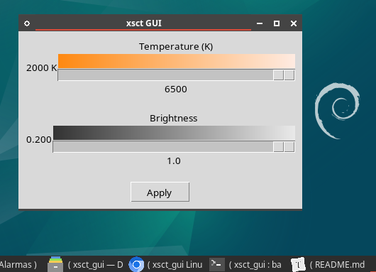

# xsct_gui
A GUI for xsct - set color temperature of screen

# Tutorial de uso: xsct GUI

Este tutorial te guiará a través del uso de la interfaz gráfica para el programa xsct, que te permite ajustar la temperatura de color y el brillo de tu monitor en Linux Debian 12 o derivados de ellos como MX Linux 23 y puede que funcione en otras versiones u otros Linux

## Requisitos previos

Antes de comenzar, asegúrate de tener instalado lo siguiente:

1. Python 3
2. Tkinter (paquete python3-tk)
3. Tk development files (paquete tk-dev)
4. El programa xsct

Puedes instalar los paquetes necesarios con el siguiente comando:

```
sudo apt install python3-tk tk-dev xsct
```

## Inicio del programa

1. Abre una terminal.
2. Navega hasta el directorio donde guardaste el archivo `xsct_gui.py`.
3. Ejecuta el siguiente comando:

   ```
   python3 xsct_gui.py
   ```

4. Se abrirá la ventana de la interfaz gráfica de xsct.

## Uso de la interfaz

La interfaz consta de dos secciones principales: el selector de temperatura y el selector de brillo:



### Ajuste de la temperatura de color

1. En la parte superior de la ventana, encontrarás la sección "Temperature (K)".
2. Verás una barra de gradiente que va desde el naranja (2000K) hasta el blanco (6500K).
3. Debajo de la barra de gradiente hay un deslizador.
4. Mueve el deslizador hacia la izquierda para disminuir la temperatura (más cálida, tonos naranjas) o hacia la derecha para aumentarla (más fría, tonos azules).
5. El valor actual de la temperatura se muestra debajo del deslizador en Kelvin.

### Ajuste del brillo

1. En la parte inferior de la ventana, encontrarás la sección "Brightness".
2. Verás una barra de gradiente que va desde el gris oscuro (0.200) hasta el blanco (1.000).
3. Debajo de la barra de gradiente hay un deslizador.
4. Mueve el deslizador hacia la izquierda para disminuir el brillo o hacia la derecha para aumentarlo.
5. El valor actual del brillo se muestra debajo del deslizador en una escala de 0.200 a 1.000.

### Aplicación de los cambios

Los cambios se aplican automáticamente al mover los deslizadores. Sin embargo, también puedes usar el botón "Apply" en la parte inferior de la ventana para asegurarte de que los cambios se han aplicado.

## Consejos de uso

- Para un uso nocturno, considera usar temperaturas más bajas (3000K - 4000K) y niveles de brillo reducidos (0.700 - 0.900).
- Para trabajo diurno o tareas que requieren precisión de color, usa temperaturas más altas (5500K - 6500K) y brillo máximo (1.000).
- Experimenta con diferentes combinaciones para encontrar lo que mejor se adapte a tus ojos y entorno (los focos que se utilicen en el lugar).


## Personalización

Si deseas personalizar la interfaz o agregar nuevas funcionalidades, puedes editar el archivo `xsct_gui.py` con un editor de texto. Asegúrate de entender el código Python y Tkinter antes de hacer modificaciones.

¡Disfruta de una experiencia visual más cómoda con xsct GUI!

# Sobre xsct

Este programa es una interfaz gráfica de usuario para xsct, puedes revisar este programa en: 

https://github.com/faf0/sct

En Debian 12 está en los repositorios con el nombre xsct. Es posible que en Debian 11 y derivados sea el paquete sct.

Dios les bendiga